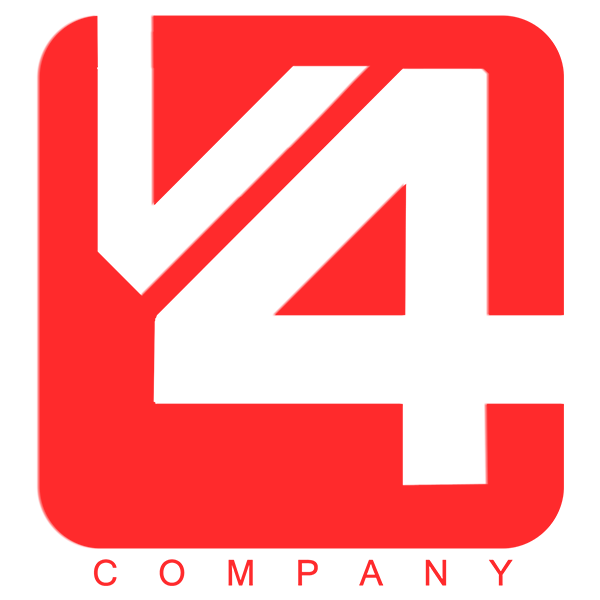
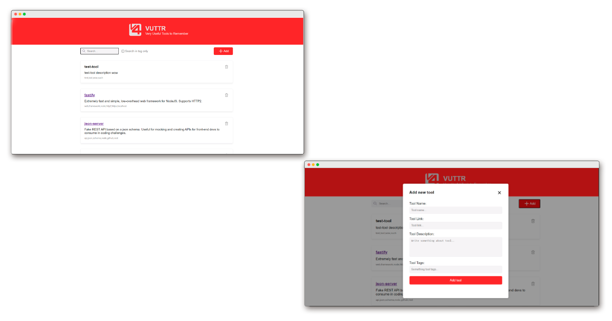

  

  Projeto desenvolvido com ReactJs.

 

## Tech

- [ReactJs](https://reactjs.org) - Uma biblioteca JavaScript de código aberto com foco em criar interfaces de usuário em páginas web.
- [Axios](https://github.com/axios/axios) - É um cliente HTTP que funciona tanto no browser quanto em node.js.
- [JSON Server](https://www.npmjs.com/package/json-server) - Uma biblioteca capaz de simular uma API.
